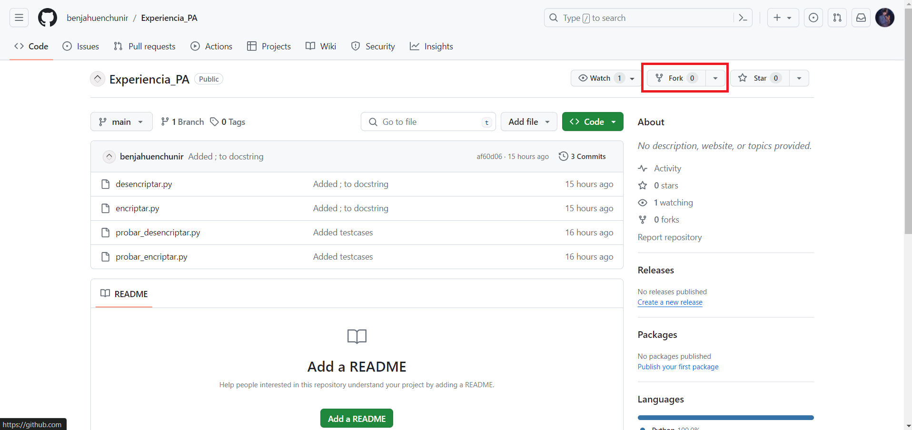
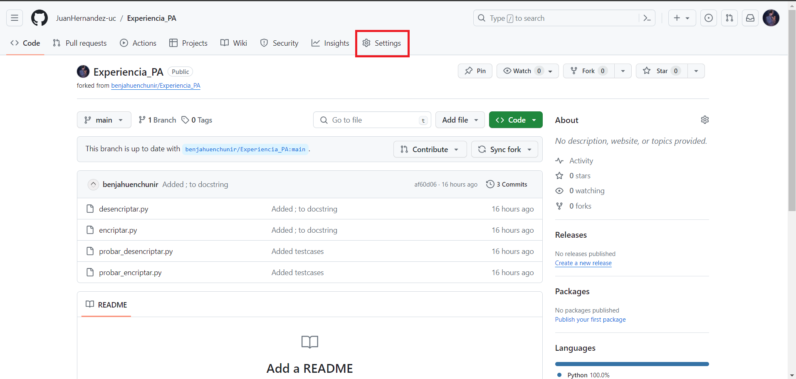
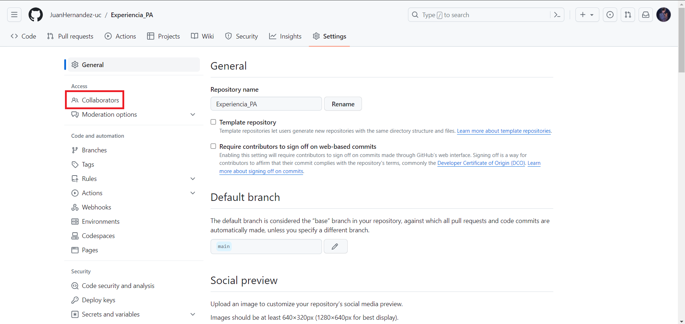
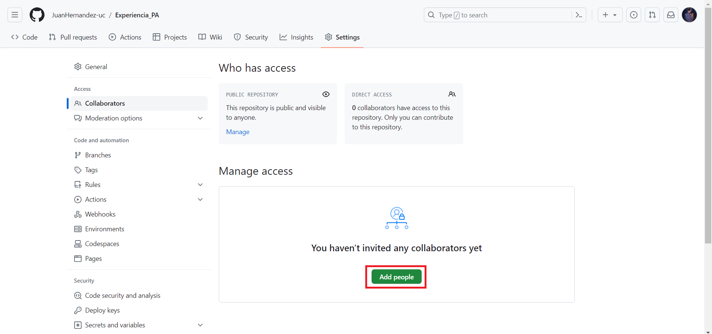
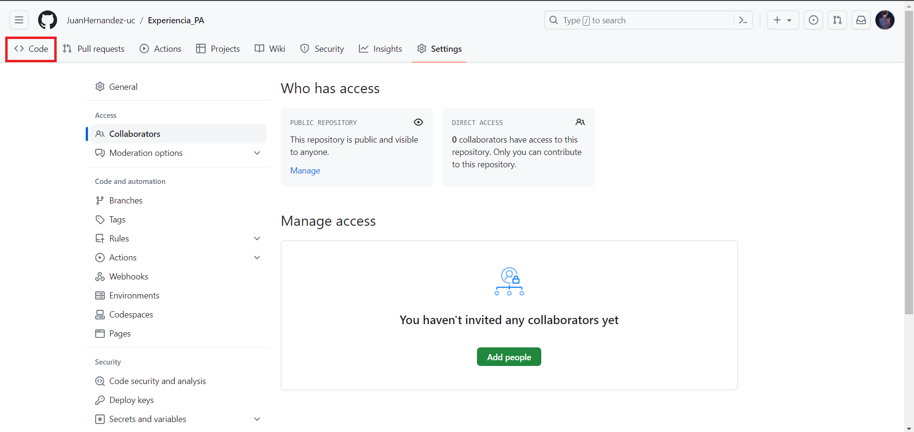
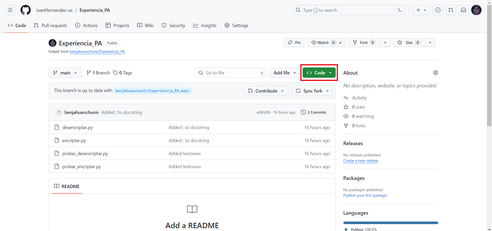
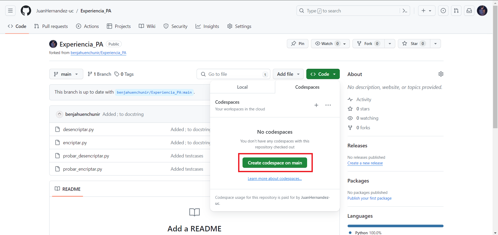
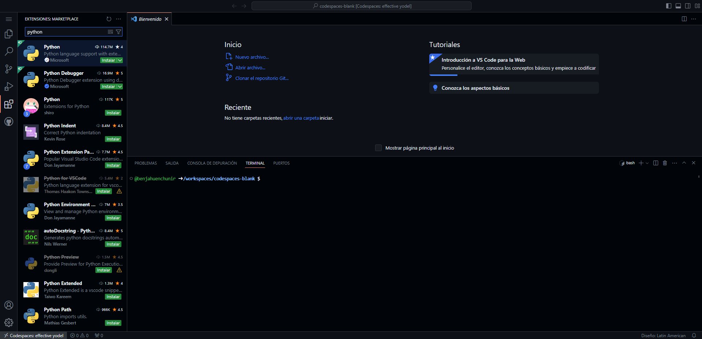

# PA

Guia experiencia Programación avanzada

## Pasos (Paso 1 y 2 los hace solo una persona del grupo)

### 1: Clona este repositorio en tu cuenta personal

1. Inicia sesión en Github
2. Apreta el botón fork

### 2: Invita a tu compañero/a a colaborar

1. Una vez clonado el repositorio, anda a Settings

2. Selecciona "collaborators"

3. Clickea en "add people"

4. Busca el nombre de tu compañero/a en github e invitalo a colaborar

### 3. Creación de Codespaces

1. Vuelve a la base de tu repositorio

2. Selecciona "<> Code"

3. Clickea en "Create codespace on main"

### 4: Instala python en el entorno

1. Apreta el boton de extensiones de la barra lateral y busca python
2. Haz click en instalar
    

### 5. Soluciona los desafios y guarda los cambios

1. Cada integrante debe solucionar uno de los desafios. Una vez que hayas hecho el desafío, tienes que subirlo al repositorio (recuerda los comandos vistos en la clase)